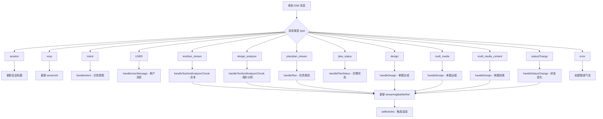

# ChatContent 组件运行流程

> 本文档由代码分析自动生成，梳理 ChatContent 组件的核心运行逻辑和接口关系。

## 一、核心接口关系

### 1. 三大数据源接口

| 接口                      | 函数名            | 用途         | 调用时机                         |
| ------------------------- | ----------------- | ------------ | -------------------------------- |
| `/alpha-shop/agent/chat`  | `fetchStream`     | SSE 实时对话 | 用户发送消息、重连续传           |
| `/chatSession/detail`     | `queryChatDetail` | 查询会话详情 | 进入已有会话、重连前获取最新状态 |
| `/shareRecord/readByCode` | `getShareRecord`  | 查询分享记录 | 分享页加载                       |

### 2. 接口关系图

```
┌─────────────────────────────────────────────────────────────────────────┐
│                           ChatContent 组件                               │
├─────────────────────────────────────────────────────────────────────────┤
│                                                                         │
│   ┌─────────────────────────────────────────────────────────────────┐   │
│   │                      数据来源判断                                │   │
│   └─────────────────────────────────────────────────────────────────┘   │
│                                  │                                      │
│           ┌──────────────────────┼──────────────────────┐               │
│           │                      │                      │               │
│           ▼                      ▼                      ▼               │
│   ┌───────────────┐      ┌───────────────┐      ┌───────────────┐       │
│   │  isShared=true │      │  有 sessionId  │      │  新会话(无ID) │       │
│   │   分享页模式   │      │   历史会话模式  │      │   新建会话    │       │
│   └───────────────┘      └───────────────┘      └───────────────┘       │
│           │                      │                      │               │
│           ▼                      ▼                      ▼               │
│   ┌───────────────┐      ┌───────────────┐      ┌───────────────┐       │
│   │ readByCode    │      │ detail 接口   │      │ 等待用户输入  │       │
│   │ 获取分享数据  │      │ 获取会话历史  │      │               │       │
│   └───────────────┘      └───────────────┘      └───────────────┘       │
│           │                      │                      │               │
│           │                      │ taskStatus=RUNNING?  │               │
│           │                      ├──────────┐           │               │
│           │                      │    是    │           │               │
│           │                      ▼          │           │               │
│           │              ┌───────────────┐  │           │               │
│           │              │ chat SSE 接口 │◄─┴───────────┘               │
│           │              │ 继续接收流式  │                              │
│           │              └───────────────┘                              │
│           │                      │                                      │
│           ▼                      ▼                                      │
│   ┌─────────────────────────────────────────────────────────────────┐   │
│   │                    processQueue 消息队列处理                     │   │
│   │          (使用 handlerMaps 分发不同类型消息给对应处理器)          │   │
│   └─────────────────────────────────────────────────────────────────┘   │
│                                  │                                      │
│                                  ▼                                      │
│   ┌─────────────────────────────────────────────────────────────────┐   │
│   │                         UI 渲染                                  │   │
│   │            bubbles 数组 → Content 组件 → 气泡列表                │   │
│   └─────────────────────────────────────────────────────────────────┘   │
│                                                                         │
└─────────────────────────────────────────────────────────────────────────┘
```

## 二、整体运行流程

### 阶段一：初始化

```
组件挂载 (useEffect)
        │
        ├─── 无 sessionId ──► 新会话模式 ──► 显示空界面，等待用户输入
        │
        ├─── 有 sessionId ──► 调用 getDetail(sessionId)
        │                          │
        │                          ├─► 获取 latestEventId / latestTaskId
        │                          │
        │                          └─► taskStatus === "RUNNING"?
        │                                    │
        │                                    ├── 是 ──► 调用 fetchStream 继续接收
        │                                    │
        │                                    └── 否 ──► 仅显示历史记录
        │
        └─── isShared=true ──► 调用 getShareData(shareCode)
                                   │
                                   └─► readByCode 接口获取分享数据
                                           │
                                           └─► processQueue 回放消息
```

### 阶段二：用户发送消息

```
用户输入 + 点击发送
        │
        ▼
InputChat 组件 sendMessage
        │
        ├─► 1. 创建 user 气泡添加到 streamingBubbleRef
        │
        ├─► 2. 调用 store.addImgElement / addOfferElement (画布相关)
        │
        └─► 3. 调用 fetchStream 发起 SSE 请求
                   │
                   ▼
        ┌──────────────────────────────────────┐
        │           SSE 事件循环               │
        ├──────────────────────────────────────┤
        │  onopen   ──► 连接成功，状态=RUNNING │
        │  onmessage ──► 解析消息，加入队列    │
        │  onerror  ──► 错误处理/重试         │
        │  onclose  ──► 连接关闭              │
        └──────────────────────────────────────┘
                   │
                   ▼
        processQueue 处理消息队列
                   │
                   ▼
        handlerMaps 分发给对应处理器
```

### 阶段三：消息处理



## 三、状态管理

### 1. SSE 连接状态 (sseStatus)

```typescript
enum SSE_STATUS {
  DEFAULT = "default", // 初始状态
  RUNNING = "running", // SSE 连接中，正在接收数据
  ERROR = "error", // 连接错误
  CLOSE = "close", // 连接已关闭
}
```

### 2. 任务执行状态 (taskStatus)

```typescript
enum TASK_STATUS {
  IDLE = "idle", // 空闲，没有任务
  RUNNING = "running", // 任务正在执行
  WAITING = "waiting", // 任务等待中（stopForWaiting）
  COMPLETED = "completed", // 任务已完成（allDone）
  STOPPED = "stopped", // 任务已停止（stopByUser 或手动停止）
}
```

### 3. 输入框状态 (Status)

```typescript
enum Status {
  DEFAULT = "default", // 默认状态，可输入
  RUNNING = "running", // 正在处理，显示停止按钮
  LOADING = "loading", // 加载中
  PAUSED = "paused", // 已暂停
}
```

### 4. 状态转换流程

```
用户发送消息
    │
    ├─► sseStatus: DEFAULT → RUNNING
    ├─► taskStatus: IDLE → RUNNING
    └─► Status: DEFAULT → RUNNING

收到 statusChange: allDone
    │
    ├─► sseStatus: → CLOSE
    ├─► taskStatus: → COMPLETED
    └─► Status: → DEFAULT

收到 statusChange: stopForWaiting
    │
    ├─► taskStatus: → WAITING
    └─► 设置定时器，等待后重连

用户点击停止
    │
    ├─► sseStatus: → CLOSE
    ├─► taskStatus: → STOPPED
    ├─► Status: → LOADING → DEFAULT
    └─► 调用 stopChat 接口
```

## 四、多步骤任务处理

### 1. Plan 任务规划结构

```typescript
interface Plan {
  planId: string; // 计划唯一标识
  stepNum: number; // 步骤总数
  steps: Array<{
    stepId: number; // 步骤ID
    stepTitle: string; // 步骤标题
    displayTitle: string; // 显示标题
    displayContent: string; // 显示内容
    agentName: string; // 执行的 Agent
  }>;
}
```

### 2. 步骤卡片结构 (StepCard)

```typescript
interface StepCardBubble {
  role: "assistant";
  card_detail: {
    type: "step_card";
    stepId: string;
    stepTitle: string;
    planId: string;
    is_uncompleted: boolean;
    contentBlocks: Array<{
      type: "text" | "design" | "multi_media";
      content: any;
    }>;
  };
}
```

### 3. 多步骤消息处理流程

```
收到 plan_stream
    │
    └─► handlePlan()
            │
            ├─► 解析步骤信息
            ├─► 保存到 currentPlanRef
            └─► 创建任务规划气泡

收到带 stepId 的消息
    │
    └─► 根据 stepId 找到或创建 step_card
            │
            ├─► stepCardBubbleIndexRef.get(key)
            │
            ├─► 找到 → 更新对应步骤卡片
            │
            └─► 未找到 → insertStepCardInOrder() 按顺序插入

收到 plan_status (status=FINISH)
    │
    └─► handlePlanStatus()
            │
            └─► 标记对应步骤完成
```

## 五、等待重连机制 (stopForWaiting)

### 流程图

```
收到 statusChange: stopForWaiting
        │
        ├─► 检查 taskStatus 是否已完成/停止
        │       │
        │       └─► 是 → 忽略，不设置定时器
        │
        └─► 否 → 设置等待定时器
                    │
                    ├─► taskStatus = WAITING
                    ├─► isWaitingForResumeRef = true
                    └─► setTimeout(waitTime, callback)
                              │
                              ▼
                    ┌───────────────────────────────────┐
                    │       定时器回调执行               │
                    ├───────────────────────────────────┤
                    │ 1. 检查 taskId 是否匹配           │
                    │ 2. 检查 taskStatus 是否 WAITING   │
                    │ 3. 检查 isWaitingForResumeRef     │
                    │ 4. 调用 detail 获取最新 eventId   │
                    │ 5. 检查是否已有 allDone          │
                    │    └─► 是 → 更新界面，不重连     │
                    │ 6. 否 → fetchStream 继续请求      │
                    └───────────────────────────────────┘
```

### 关键保护措施

1. **taskId 校验**：防止不同任务的定时器互相干扰
2. **taskStatus 校验**：只有 WAITING 状态才继续请求
3. **detail 接口获取最新状态**：避免使用过期的 eventId
4. **allDone 检测**：如果任务已完成，直接更新界面不重连

## 六、气泡数据结构

### 1. streamingBubbleRef (内存中的气泡列表)

```typescript
interface Bubble {
  role: "user" | "assistant" | "heartbeat" | "taskEndStatus";
  intent?: string;
  card_detail: {
    type?: string; // text, design, multi_media, step_card, plan, etc.
    content?: any;
    is_uncompleted?: boolean;
    media_items?: MediaItem[];
    multiImages?: MultiImageItem[];
    contentBlocks?: ContentBlock[]; // 步骤卡片专用
    // ... 其他字段
  };
}
```

### 2. 关键 Ref 映射

| Ref                      | 类型                              | 用途                                       |
| ------------------------ | --------------------------------- | ------------------------------------------ |
| `cardIdMapRef`           | `Map<cardId, bubbleIndex>`        | 通过 cardId 快速找到气泡位置（多图回填用） |
| `stepCardBubbleIndexRef` | `Map<planId_stepId, bubbleIndex>` | 通过 planId+stepId 找到步骤卡片            |
| `currentPlanRef`         | `{ stepNum, steps, planId }`      | 当前任务规划信息                           |

## 七、消息类型完整列表

| 类型                    | 处理函数                     | 说明                                   |
| ----------------------- | ---------------------------- | -------------------------------------- |
| `session`               | 内联                         | 更新会话标题                           |
| `resp`                  | 内联                         | 更新 sessionId（首次创建会话）         |
| `intent`                | `handleIntent`               | 识别对话意图（mediaTask/smallTalk 等） |
| `USER`                  | `handleUserMessage`          | 用户消息                               |
| `text`                  | `handleTextAndAnalyzerChunk` | 文本消息（支持打字机）                 |
| `text_stream`           | `handleTextAndAnalyzerChunk` | 流式文本                               |
| `design_analyzer`       | `handleTextAndAnalyzerChunk` | 图片理解分析                           |
| `error`                 | 内联                         | 错误消息                               |
| `design`                | `handleDesign`               | 单图生成（含进度）                     |
| `multi_media`           | `handleDesign`               | 多图出框（创建占位）                   |
| `multi_media_content`   | `handleDesign`               | 多图内容回填                           |
| `multi_percent_loading` | `handleDesign`               | 多图进度更新                           |
| `percent_loading`       | `handleDesign`               | 单图进度更新                           |
| `plan` / `plan_stream`  | `handlePlan`                 | 任务规划                               |
| `plan_status`           | `handlePlanStatus`           | 步骤完成状态                           |
| `statusChange`          | `handleStatusChange`         | 全局状态变化                           |
| `text_card`             | `handleCommonMsg`            | 文本卡片出框                           |
| `text_card_content`     | `handleCommonMsg`            | 文本卡片内容                           |
| `knowledge`             | `handleCommonMsg`            | 知识库消息                             |
| `oneClickOptResult`     | `handleOneClickOptResult`    | 一键优化结果                           |
| `offer`                 | `handleChatGeneratedOffer`   | 对话生成商品                           |

## 八、statusChange 状态详解

| 状态             | 含义           | 处理                              |
| ---------------- | -------------- | --------------------------------- |
| `start`          | 开始新消息块   | 创建新的 assistant 气泡           |
| `end`            | 结束当前消息块 | 标记气泡 `is_uncompleted = false` |
| `allDone`        | 任务完成       | 添加"任务已结束"气泡，清理定时器  |
| `stopByUser`     | 用户手动停止   | 添加"任务已终止"气泡，清理定时器  |
| `stopForWaiting` | 需要等待重连   | 设置定时器，等待后继续请求        |

## 九、文件结构

```
ChatContent/
├── index.tsx              # 主组件（3500+ 行）
├── index.d.ts             # 类型定义
├── index.module.scss      # PC 端样式
├── index.mobile.module.scss # 移动端样式
├── assets.ts              # 资源（兜底图等）
├── components/
│   ├── header/            # 顶部导航
│   ├── content/           # 消息内容区
│   │   ├── index.tsx      # Content 组件
│   │   └── bubbles/       # 各类气泡组件
│   │       ├── user.tsx
│   │       ├── text.tsx
│   │       ├── design.tsx
│   │       ├── multi-media.tsx
│   │       ├── step-card.tsx
│   │       ├── planning.tsx
│   │       └── ...
│   └── historyList/       # 历史记录列表
├── hooks/
│   └── useTypingEffect.ts # 打字机效果 Hook
├── mock/                  # 模拟数据
└── utils/
    └── index.ts           # 工具函数
```

## 十、注意事项

### 1. 代码复杂度问题

- 主文件 3500+ 行，建议拆分
- 消息处理逻辑耦合严重，可考虑策略模式重构

### 2. 状态管理问题

- 多个 Ref 之间存在依赖，需要注意同步
- taskStatus 和 sseStatus 需要配合使用，单独看会有状态不一致风险

### 3. 多图处理

- 使用 `cardIdMapRef` 做索引映射
- 支持动态扩展数组（mediaIndex 超出时自动扩展）
- 需要处理失败情况（显示兜底图）

### 4. 重连机制

- 通过 `stopForWaiting` 触发
- 重连前调用 `detail` 获取最新 eventId
- 有多重校验防止重复/错误重连
